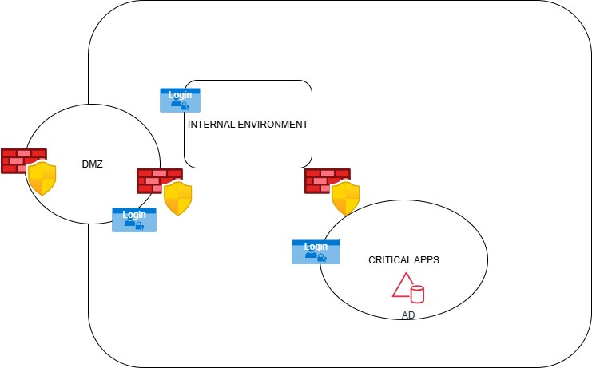
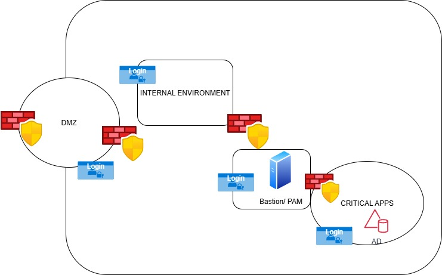
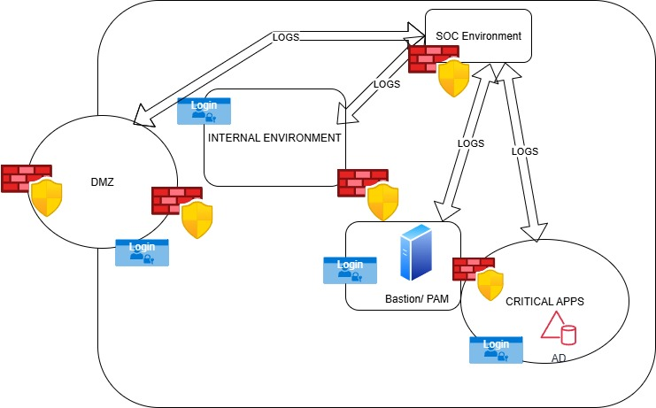

# Is Defense in Depth still relevant?

Defense in depth has long been a topic graduates and organizations have followed. In day-to-day terms, defense in depth is basically the act of building a fence around your land, then a gate with a lock at the edge, a door with a different lock (like a key pad) at the entrance of your home, having strong walls, windows that are not easily reachable by an average human, iron grills fitted behind the windows that can be accessed by anyone outside, different doors with individual locks to different rooms, having CCTV, or perhaps, if you have important stuff in your home, even having a dog or a security guard. 

Similarly, in traditional on-premises environments, the “fence” has always been a firewall and the different doors are always other “internal firewalls” or sometimes VLANs configured in switches. Endpoint protection software act as the lock to your money vault or cupboard (where your clothes and jewelry are stored). Log monitoring has always acted as the CCTV where the SIEM is always “logically”, sometimes physically segregated (in another location – could be a managed security service provider). 
But is it the same in the cloud? Now that it has pretty much become a one-stop-shop for all needs.

Keeping aside regulatory requirements that need to be adhered to (sometimes resulting in opting out of the cloud), any architecture still needs defense in depth. This is why there is a “**shared responsibility model**” in the cloud. 
#### The cloud service provider will own and handle 
* The physical security of the data centers hosting the servers that run the hypervisors on top of which client applications, services and data are run and stored.
* Patching and vulnerability management of the server operating system and hypervisor.
*	Access control of who can access the servers (physically) and who can configure server configurations.
#### The client (i.e. you and I) will own:
*	The protection of the application and environment created on the virtualized environment run on top of the hypervisors. 

So, what does “**_The protection of the application and environment created on the virtualized environment run on top of the hypervisors_**” mean?

I will explain my view on how a system must generally be designed, irrespective of data criticality. 

## The general Don’t-you-think-you-can-ignore-because-it’s-a-simple-system practices
### 1.	Network segmentation
•	Yes – even if your system is only accessible internally, ensure it is, logically segmented, especially from more critical systems. The segmentation can be done via firewalls (L3&L4 in the OSI model), access control lists, even via VLANs (L2 in the OSI model). In the cloud, you could do it via network security groups.
 
•	In this high-level diagram, I have used a firewall as a means to act as the boundary patrol for incoming and outgoing traffic between the 3 zones: DMZ, Internal and Critical apps.
•	Organizations can have any number of zones, depending on business criticality, regulations and compliance. The public cloud itself could be considered a separate zone (with a different risk level) in the case of hybrid infrastructure. 

### 2.	Identity and access management
•	Every user and device must authenticate themselves when attempting to access a system. This could be
i.	 via manual username/password input or Single Sign On (for users).
ii.	Service accounts or similar (for devices)
•	Every account must follow principle of least privilege, only being granted access to permissions and resources that are needed (rather than everything or every possible combination – because it will be ‘easier’ to work so)
i.	Why is this the case? In case your account gets compromised, if you had the “nice to have” configuration in place, you will give the malicious actor a free pass into all possible combinations of access to further compromise other systems.
•	This will result in the requirement to have a centralized register to track all accounts and permissions (this is where Active Directory comes into play). 
i.	This centralized register will therefore become the “crown jewel” of an enterprise. If this gets compromised, a malicious actor will have full power over the whole organization.
 

#### Privilege Access Management
•	Accounts with elevated access (i.e. administrators or other roles that have similar or higher privileges) need to be protected more than other “user” accounts because a compromised administrator account can cause grave damage than a normal user account.
•	Some controls that, at minimum, must be in place, are:
o	Multi Factor Authentication – to further confirm that the admin is really who he/she claims to be.
o	Auditing – to monitor and review what actions are done with the privileged access
o	Using a jump host / bastion to access the endpoint server
	The bastion will be in a segregated location, with tight <preferably host to host firewalls rules in place>
	The bastion host must be patched and use a golden image at minimum CIS benchmarked)
If you do have sufficient budget, instead of a manual bastion host, you could leverage PAM (Privilege Access Management) service, which will do all of the above (except MFA – which ideally must be controlled by the Identity access server.
BUT – the PAM must be configured correctly so that it is worth for the money spent!

 
 
### 3.	Auditing and monitoring
•	It is always recommended to monitor logs from the perimeter, different trust boundaries and activity within critical assets to ensure that any attempt to compromise the organization is either spotted before completion. Logs also help threat hunting to be conducted.

•	The logging server / SIEM must be segregated from live environment. Some companies hand over the monitoring to third party MSSP (Manage security service providers), whose SOC continually monitors the infrastructure per signed agreement.

 
 
### 4.	DevSecOps
•	Given that SDLC is now agile, the overall speed of delivery has increased as the pipeline is more flexible and adaptable to changing requirements. Plus, infrastructure as a code has been the way of working lately where, not only an application’s code, but the whole infrastructure (firewalls, access lists, WAF, security controls etc) are coded and deployed. This enables the ease of creating templates (with baseline security in place).
•	The problem with code is that, developers may not use the “secure” way (eg: old binaries, bad coding practices) to ensure deadlines are met.
•	To ensure that developers do the right thing from the inception (reducing the need to redo everything before of ‘obvious critical issues’ that were spotted during a pentest conducted for go-live), it is always recommended to integrate security from the design phase (i.e. shift left).
•	Some controls that can be in place are:
i.	Security plugins in the IDE – spotting errors as developers type in their code. Lately, copilot for Git does the same.
ii.	SCA scans to be run during code design phase. 
iii.	SAST scans before pushing code to the main branch
iv.	DAST (includes pen testing) prior to pushing code to production.
•	Outside the pipeline, Developers themselves need to have controlled access
i.	Access to the repositories must be opened internally
1.	If they are working from home, access preferably must be over VPN, unless services such as Intune, conditional access (risk-based access) are configured.
ii.	Junior developers, especially interns, ideally must not be assigned to roles where they can push code to the main/production branches. 
1.	i.e. proper role-based access control must be in place
iii.	Changes ideally must be peer-reviewed prior to pushing to the main branch.
iv.	Issues highlighted by the security tooling must be remediated asap, unless they are false positives. In case they are the latter or are a “low priority” proper justification must be given and recoded for transparency and auditing purposes. If any remediation needs more time, and may be only resolved post go-live, a proper risk tracking must be in place, with the plan and tentative deadline agreed upon (as the risk is active until remediation).

### 5.	Third party / SAAS integration
•	Third party tooling can be any service that your organization leverages that is not in-house built – this could be the Atlassian stack, snowflake, github cloud, included security services such as qualys, cloudflare etc.
•	Always,
i.	Understand how your “tenant” is segregated from other clients, especially since your competitors could also be using the same service
ii.	Understand the service provider’s incident response process
iii.	Understand what controls you, as their client can configure and what controls they have already in place (especially if you are to push sensitive data into their cloud, and eventually their datacenters)
1.	Please note – sometimes such services run on top of the public cloud.
iv.	Configure the relevant security controls (IAM, Auditing – where possible, principle of least privilege, service access internally rather than over the internet, etc). Do your part correctly as this too is a “shared responsibility model”.
v.	If you are a regulated entity, understand if the overarching regulations allow SaaS integrations and follow the guidelines set by the regulators. 
vi.	Understand what would happen to your data once you no longer use their service.

These are a very high level (overly summarized) set of controls that, at the very minimum must be considered. I will be discussing them in detail in future chapters

Until next time!

# Version Control
24/09/2025 - Initial draft
08/10/2025 - General controls included
